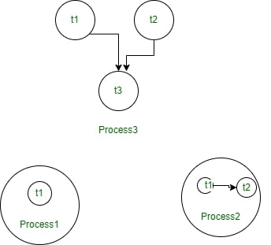
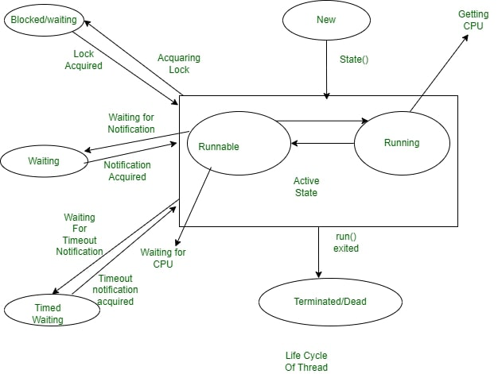

# Understanding Threads and Multithreading

## Introduction to Threads
Threads are lightweight subprocesses that represent the smallest unit of execution within a program. Each thread has a separate execution path but shares resources like memory with other threads of the same process. The primary advantage of multithreading is efficiency, allowing multiple tasks to execute simultaneously. For example, in MS Word, one thread handles automatic formatting while another takes user input. Multithreading ensures responsiveness by allowing other threads to continue execution even if one becomes stuck.

## Threads in a Shared Memory Environment
Threads operate within a shared memory environment in an operating system. As shown in the conceptual diagram (not included), threads exist within processes, and there can be multiple threads within a single process. Simultaneously, multiple processes can run on the OS, each containing multiple threads. This concept is widely applied in applications like games and animations.

## Multitasking in Operating Systems
Operating systems enable users to perform multiple actions simultaneously through multitasking. Multitasking can be categorized into:

### 1. Process-Based Multitasking (Multiprocessing)
- Involves heavyweight processes.
- Each process has a separate memory space.
- Communication between processes is costly and involves significant overhead (e.g., saving and loading registers, updating maps, etc.).

### 2. Thread-Based Multitasking
- Threads are lightweight and share the same address space.
- Communication between threads is efficient and low-cost.

Thread-based multitasking is preferred due to its lightweight nature and effectiveness in shared memory environments.

## Life Cycle of a Thread
A thread transitions through various states during its lifecycle:

### 1. New State
- The thread is created but has not started execution.
- The thread remains in this state until the `start()` method is called.

### 2. Active State
An active thread can be in one of two sub-states:
- **Runnable State**: The thread is ready to run and waits for the CPU to allocate time for execution.
- **Running State**: The thread is actively executing after being allocated CPU time. After its time slice expires, it returns to the runnable state.

### 3. Waiting/Blocked State
- A thread enters the waiting or blocked state when it cannot proceed temporarily.
  - **Waiting State**: Occurs when a thread is waiting for a resource (e.g., T1 waits for T2 to release a camera).
  - **Blocked State**: Occurs when multiple threads attempt to access a resource simultaneously, leading to contention.
- Thread Scheduler handles waiting threads based on priority and clears unnecessary threads.

### 4. Timed Waiting State
- Prevents starvation by setting a time limit for a thread to wait.
- After the specified time expires, the thread resumes execution.
- Commonly implemented using the `sleep()` method.

### 5. Terminated State
- A thread reaches the terminated state when it finishes its task.
- Termination can occur normally or abnormally (e.g., due to exceptions or segmentation faults).
- A terminated thread is considered dead and cannot be revived.

## Java Main Thread
In Java, every program has a main thread, provided by the JVM, which acts as the entry point for execution. The main thread is created automatically whenever a Java program is run.

## Advantages of Threads
- **Lightweight**: Threads consume fewer resources than processes.
- **Shared Address Space**: Enables efficient communication.
- **Efficient Multitasking**: Facilitates responsiveness and concurrent execution.

By understanding threads and their lifecycle, developers can design applications that utilize multithreading effectively, enhancing performance and user experience.

